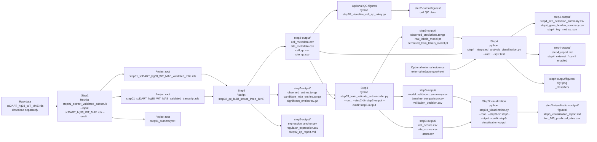
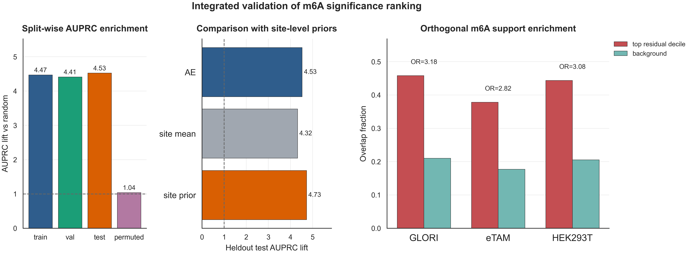
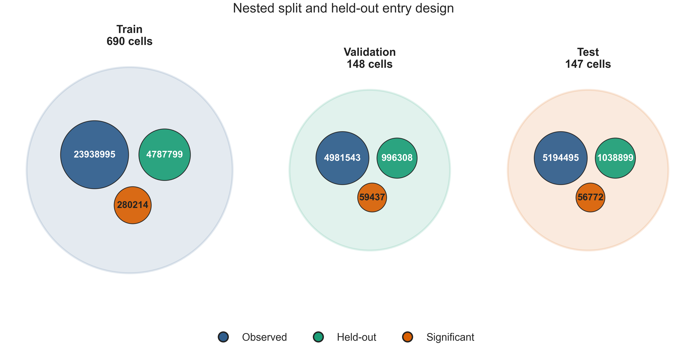
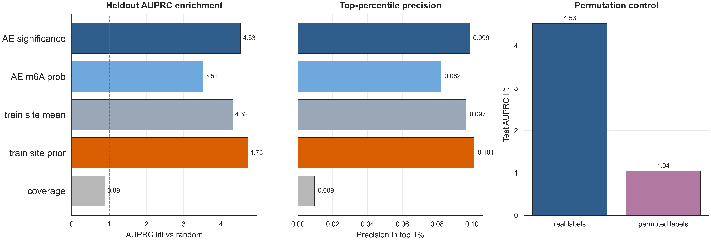
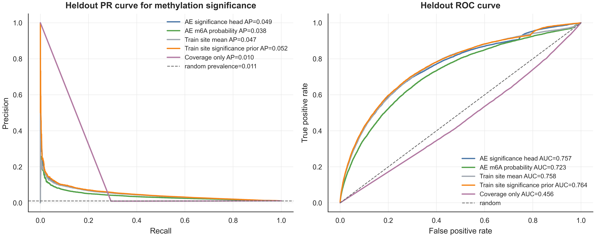
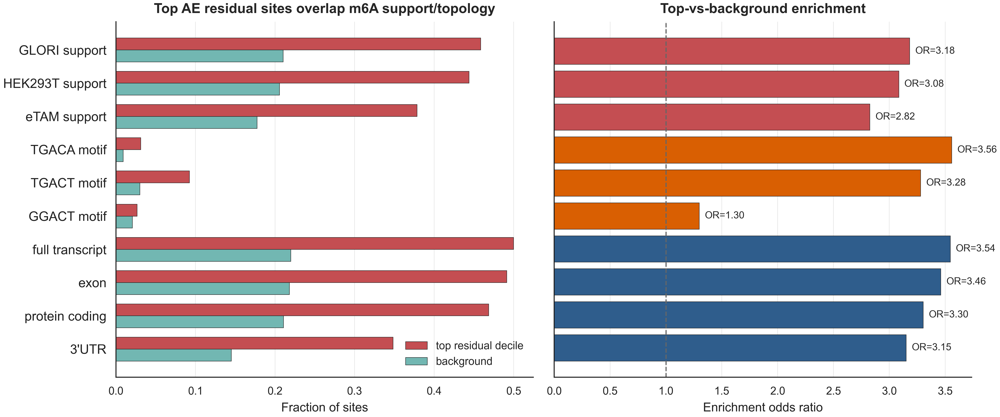

# scDART-seq m6A Sparse Autoencoder Workflow

## Original Data Download

The original input file `scDART_hg38_WT_MAE.rds` is too large for normal GitHub storage. Download it from m6AConquer and place it in the project root before running the full workflow.

- Download URL: <[http://180.208.58.19/m6aconquer/Download/Human/MAE_WT/scDART_hg38_WT_MAE.rds](http://180.208.58.19/m6aconquer/Download/Human/MAE_WT/scDART_hg38_WT_MAE.rds)>
- Expected local path: `./scDART_hg38_WT_MAE.rds`
- File size: about 2.71 GB

On GitHub, clicking this link directly will not download the file and may show that the link is unsafe. Please copy the link and open it in your browser to download,or:

Download example:

```bash
curl -L -o scDART_hg38_WT_MAE.rds \
  http://180.208.58.19/m6aconquer/Download/Human/MAE_WT/scDART_hg38_WT_MAE.rds
```

This repository contains a reproducible workflow for building coverage-aware single-cell m6A model inputs from scDART-seq data, training a sparse count-aware autoencoder, and interpreting the learned signal with m6AConquer external evidence.

Large raw data files, intermediate `.rds` objects, model checkpoints, and some compressed prediction tables may be excluded from GitHub because of file-size limits. The scripts are written so that users can reproduce the workflow after placing the required large files in the expected local paths.

## Repository Contents

```text
.
|-- step01_extract_validated_subset.R
|-- step02_qc_build_inputs_three_tier.R
|-- step02_visualize_cell_qc_tukey.py
|-- step03_train_validate_autoencoder.py
|-- step03_visualization.py
|-- step4_extract_m6aconquer_mae.R
|-- step4_integrated_analysis_visualization.py
|-- DATA_CONTENT_OVERVIEW.md
|-- DOWNLOAD_URLS.md
|-- step2-output/
|-- step3-output/
|-- step3-visualization-output/
`-- step4-output/
```

Large local files that may not be tracked by GitHub:

```text
scDART_hg38_WT_MAE.rds
step01_scDART_hg38_WT_MAE_validated_m6a.rds
step01_scDART_hg38_WT_MAE_validated_transcript.rds
external-m6aconquer/raw/
```

## Recommended System And Environment

### Operating System

Recommended systems:

- macOS 14/15, Apple Silicon or Intel. Apple Silicon can use PyTorch MPS acceleration.
- Ubuntu 22.04/24.04 LTS, especially for server or CUDA GPU runs.
- Windows is not recommended as a native environment for this mixed R/Python workflow. If Windows is required, use WSL2 with Ubuntu.

Hardware recommendation:

- Memory: 32 GB minimum, 64 GB or more recommended. Full Step2 and Step3 runs are more comfortable with about 96 GB.
- Disk: at least 80-120 GB free space, because external data and intermediate long tables are large.
- GPU: optional. Step3 supports CPU, CUDA, or Apple MPS. CPU runs are valid but slower.

### R Environment

Recommended R version: R 4.3 or R 4.4.

Install required R packages:

```r
install.packages(c("data.table", "matrixStats", "jsonlite"))

if (!requireNamespace("BiocManager", quietly = TRUE)) {
  install.packages("BiocManager")
}

BiocManager::install(c(
  "MultiAssayExperiment",
  "SummarizedExperiment",
  "GenomicRanges",
  "S4Vectors"
))
```

### Python Environment

Recommended Python version: Python 3.10 or 3.11.

Conda setup:

```bash
conda create -n m6a-ae python=3.11 -y
conda activate m6a-ae

pip install numpy pandas scipy scikit-learn matplotlib seaborn pillow
pip install torch
```

Check the PyTorch device:

```bash
python - <<'PY'
import torch
print("torch:", torch.__version__)
print("cuda:", torch.cuda.is_available())
print("mps:", hasattr(torch.backends, "mps") and torch.backends.mps.is_available())
PY
```

### Command Line Tools

The following commands should be available:

```bash
Rscript --version
python --version
gzip --version
```

`gzip` is used to compress Step2 long-format output tables. It is available by default on most macOS and Linux systems.

## Experimental Design

The experiment is built around a conservative evidence chain:

1. Step1 defines a stable m6A site universe from the original scDART-seq MultiAssayExperiment object.
2. Step2 converts the sparse single-cell count matrices into three evidence layers without treating unobserved entries as zero methylation.
3. Step3 trains a sparse count-aware autoencoder to learn non-random m6A significance patterns from observed entries while explicitly testing generalization.
4. Step4 interprets the Step3 scores at site, cell, and external-evidence levels.

The central design principle is that low coverage and missing observations are not equivalent to biological absence. Therefore, the workflow keeps sparse count structure visible to the model instead of forcing missing entries into a dense zero-filled matrix.

### Step2 Three-Tier Evidence Construction

Step2 creates three long-format entry tables:

- `observed_entries.tsv.gz`: entries with sufficient coverage, used as the reconstruction background.
- `candidate_m6a_entries.tsv.gz`: relaxed OR evidence, where either m6A probability or adjusted p-value supports a possible event.
- `significant_entries.tsv.gz`: conservative AND evidence, where coverage, m6A probability, and adjusted p-value all support a high-confidence event.

The high-confidence significant entries are used as weak pseudo-labels. They are not treated as complete ground truth.

### Step3 Autoencoder Mechanism

Step3 is the main machine-learning stage. It is designed to answer a specific question: can a model learn a reproducible methylation-significance signal from sparse single-cell m6A counts, beyond simple site priors or random label structure?

The mechanism is:

- The model reads Step2 observed entries and builds dense tensors only for observed coverage-supported entries.
- Cell-level train/validation/test splitting is used, so held-out cells test generalization to unseen cells rather than only unseen entries from the same cells.
- Within each split, part of the observed input is hidden from the model as entry-level holdout data. The model must predict these hidden entries.
- Site-level priors are fitted only from training cells to reduce validation/test leakage.
- The reconstruction head models m6A count structure with a count-aware likelihood rather than plain mean squared error.
- A significance head learns to rank high-confidence Step2 significant entries.
- A permutation-label control is trained by permuting training labels. If the real model performs much better than the permuted model, the learned signal is less likely to be label-frequency artifact.
- Baselines such as site mean, site significance prior, and coverage-only scores are reported, so the autoencoder is evaluated against simple alternatives.

The expected interpretation is ranking-oriented: Step3 scores are useful for ranking and enrichment analysis, but they should not be over-claimed as perfectly calibrated absolute methylation probabilities.

## Workflow Mind Map



## Input Data

### Required For Full Reproduction

Place the original file in the project root:

```text
scDART_hg38_WT_MAE.rds
```

Step1 will produce:

```text
step01_scDART_hg38_WT_MAE_validated_m6a.rds
step01_scDART_hg38_WT_MAE_validated_transcript.rds
step01_summary.txt
```

### Required If Starting From Step2

If the original raw `.rds` file is unavailable but Step1 intermediate files already exist, place these two files in the project root:

```text
step01_scDART_hg38_WT_MAE_validated_m6a.rds
step01_scDART_hg38_WT_MAE_validated_transcript.rds
```

Then start from Step2.

### Optional External m6AConquer Data

External validation in Step4 requires local files under:

```text
external-m6aconquer/
`-- raw/
    |-- m6A_OrthogonallyValidatedSites_Combined_hg38.csv
    |-- m6A_OrthogonallyValidatedSites_Combined_hg38.bed
    |-- m6A_OrthogonallyValidatedSites_HEK293T_Combined_hg38.csv
    |-- m6A_OrthogonallyValidatedSites_HEK293T_Combined_hg38.bed
    |-- m6Aconquer_omicsFeatures_hg38.csv.gz
    |-- m6AConquer_supplementary_row_data_hg38.csv
    |-- GLORI_hg38_WT_MAE.rds
    |-- eTAM_hg38_WT_MAE.rds
    `-- DMR_eTAM_GLORI_Control_FTO_hg38.csv
```

See `DOWNLOAD_URLS.md` for source URLs. If these files are not available, Step4 can still run without `--enable-external-m6aconquer`.

## How To Run

Run all commands from the project root:

```bash
cd /path/to/this/repository
```

### Step1: Extract Validated scDART-seq Subset

```bash
Rscript step01_extract_validated_subset.R \
  --input scDART_hg38_WT_MAE.rds \
  --outdir .
```

Outputs:

```text
./step01_scDART_hg38_WT_MAE_validated_m6a.rds
./step01_scDART_hg38_WT_MAE_validated_transcript.rds
./step01_summary.txt
```

### Step2: Build QC-Filtered Three-Tier Inputs

```bash
Rscript step02_qc_build_inputs_three_tier.R
```

Outputs:

```text
./step2-output/
```

Key files:

- `observed_entries.tsv.gz`: main Step3 reconstruction input.
- `candidate_m6a_entries.tsv.gz`: relaxed OR-evidence table.
- `significant_entries.tsv.gz`: high-confidence AND-evidence pseudo-label table.
- `cell_metadata.csv`, `site_metadata.csv`: cell and site metadata.
- `cell_qc.csv`, `site_qc.csv`: QC summaries.
- `expression_anchor.csv`, `regulator_expression.csv`: expression support files for interpretation.
- `step02_qc_report.md`: readable Step2 report.

Optional QC visualization:

```bash
python step02_visualize_cell_qc_tukey.py \
  --step2-dir step2-output
```

Outputs:

```text
./step2-output/figures/
./step2-output/step02_cell_qc_tukey_visualization_report.md
```

### Step3: Train Sparse Count-Aware Autoencoder

Full run:

```bash
python step03_train_validate_autoencoder.py \
  --root . \
  --step2-dir step2-output \
  --outdir step3-output \
  --device auto \
  --max-sites 0 \
  --max-epochs 100 \
  --run-permutation-control
```

Quick test run:

```bash
python step03_train_validate_autoencoder.py \
  --root . \
  --step2-dir step2-output \
  --outdir step3-output-test \
  --device auto \
  --max-sites 5000 \
  --max-epochs 5 \
  --no-run-permutation-control
```

Outputs:

```text
./step3-output/
```

Key files:

- `observed_predictions.tsv.gz`: main Step4 input with entry-level model predictions.
- `real_labels_model.pt`: PyTorch model trained with real labels.
- `permuted_train_labels_model.pt`: permutation-control model.
- `model_validation_summary.csv`: model validation summary.
- `baseline_comparison.csv`: AE versus baseline comparison.
- `permutation_control_summary.csv`: permutation-control result.
- `validation_decision.csv` and `validation_decision.json`: validation decision.
- `cell_scores.csv`, `latent.csv`: cell-level latent representation and scores.
- `site_scores.csv`: site-level model scores.

### Step3 Visualization

```bash
python step03_visualization.py \
  --root . \
  --step3-dir step3-output \
  --outdir step3-visualization-output
```

Outputs:

```text
./step3-visualization-output/
./step3-visualization-output/figures/
```

Key files:

- `step3_visualization_report.md`
- `key_validation_summary.csv`
- `permutation_summary.csv`
- `top_100_predicted_sites.csv`
- `figures/`

### Step4: Integrated Downstream Analysis And Visualization

Without external m6AConquer validation:

```bash
python step4_integrated_analysis_visualization.py \
  --root . \
  --step3-dir step3-output \
  --step2-dir step2-output \
  --out-dir step4-output \
  --split test \
  --threshold 0.50 \
  --conservative-threshold 0.70
```

With external m6AConquer validation:

```bash
python step4_integrated_analysis_visualization.py \
  --root . \
  --step3-dir step3-output \
  --step2-dir step2-output \
  --out-dir step4-output \
  --split test \
  --threshold 0.50 \
  --conservative-threshold 0.70 \
  --enable-external-m6aconquer \
  --external-dir external-m6aconquer
```

Outputs:

```text
./step4-output/
./step4-output/figures/
```

Key files:

- `step4_report.md`: integrated downstream report.
- `step4_key_metrics.json`: key metrics.
- `step4_site_detection_summary.csv`: site-level detection summary.
- `step4_cell_burden_summary.csv`: cell-level burden summary.
- `step4_gene_burden_summary.csv`: gene-level burden summary.
- `step4_threshold_metrics.csv`: threshold audit.
- `step4_calibration_by_probability_bin.csv`: calibration audit.
- `step4_external_overlap_summary.csv`: external overlap/enrichment table, generated only when external validation is enabled.
- `step4_external_score_correlation.csv`: GLORI/eTAM correlation table, generated only when external validation is enabled.
- `step4_external_feature_enrichment.csv`: external feature enrichment table, generated only when external validation is enabled.
- `figures/fig*.png`: Step4 figures.
- `figures/_classified/`: automatically classified figure folders.

## Output Directory Guide

| Step | Script | Main output directory | Main downstream consumer |
|---|---|---|---|
| Step1 | `step01_extract_validated_subset.R` | project root | Step2 |
| Step2 | `step02_qc_build_inputs_three_tier.R` | `step2-output/` | Step3 and Step4 |
| Step2 QC figure | `step02_visualize_cell_qc_tukey.py` | `step2-output/figures/` | QC report |
| Step3 | `step03_train_validate_autoencoder.py` | `step3-output/` | Step3 visualization and Step4 |
| Step3 visualization | `step03_visualization.py` | `step3-visualization-output/` | report figures |
| Step4 | `step4_integrated_analysis_visualization.py` | `step4-output/` | final biological interpretation |
| Step4 external helper | `step4_extract_m6aconquer_mae.R` | `external-m6aconquer/processed/` via Step4 | Step4 external validation |

## Reproducibility Checklist

Check required large files:

```bash
ls -lh scDART_hg38_WT_MAE.rds
ls -lh step01_scDART_hg38_WT_MAE_validated_m6a.rds
ls -lh step01_scDART_hg38_WT_MAE_validated_transcript.rds
```

Check R dependencies:

```bash
Rscript -e "library(MultiAssayExperiment); library(SummarizedExperiment); library(GenomicRanges); library(data.table); library(matrixStats); library(jsonlite)"
```

Check Python dependencies:

```bash
python - <<'PY'
import numpy, pandas, scipy, sklearn, matplotlib, seaborn, PIL, torch
print("python dependencies OK")
print("torch device cuda:", torch.cuda.is_available())
print("torch device mps:", hasattr(torch.backends, "mps") and torch.backends.mps.is_available())
PY
```

Run the workflow in order:

```bash
Rscript step01_extract_validated_subset.R --input scDART_hg38_WT_MAE.rds --outdir .
Rscript step02_qc_build_inputs_three_tier.R
python step03_train_validate_autoencoder.py --root . --step2-dir step2-output --outdir step3-output --device auto
python step03_visualization.py --root . --step3-dir step3-output --outdir step3-visualization-output
python step4_integrated_analysis_visualization.py --root . --step3-dir step3-output --step2-dir step2-output --out-dir step4-output --split test
```

## Large File Policy For GitHub

Do not upload the following large files to normal GitHub storage unless Git LFS is configured:

```text
*.rds
*.RData
*.pt
*.tsv.gz
external-m6aconquer/raw/
```

Recommended practice:

- Track scripts, README files, reports, small summary CSV files, and selected figures.
- Keep large raw/intermediate data locally or in institutional storage.
- Record data source URLs and checksums in `DOWNLOAD_URLS.md` or a manifest file.
- Use Git LFS or GitHub release assets if model checkpoints or large prediction tables must be shared.

## Citation And Data Source

External m6AConquer data source:

- m6AConquer website: <https://rnamd.org/m6aconquer/>
- Download map: see `DOWNLOAD_URLS.md`

The recommended citation is recorded in `DATA_CONTENT_OVERVIEW.md`.

## Selected Result Figures

The following figures are selected from the generated Step4 outputs because they best explain the workflow design, Step3 validation mechanism, and biological interpretation.

### 1. Full Evidence Chain



This figure summarizes how validated site selection, three-tier Step2 labels, Step3 autoencoder validation, and Step4 external evidence are connected.

### 2. Step3 Split And Holdout Design



This method figure shows the cell-level train/validation/test split and the hidden-entry design used to test whether the autoencoder can predict held-out observed entries.

### 3. Model Versus Baselines



This figure compares the Step3 autoencoder against simple baselines and the permutation-label control. It is the main evidence that the model learns a non-random signal.

### 4. Held-Out PR And ROC Curves



These curves show how well the Step3 scores rank held-out high-confidence significant entries compared with background entries.

### 5. External Biological Support



This figure links high autoencoder residual/event sites to external m6AConquer support, transcript topology, motif-like features, and other biological annotations.
