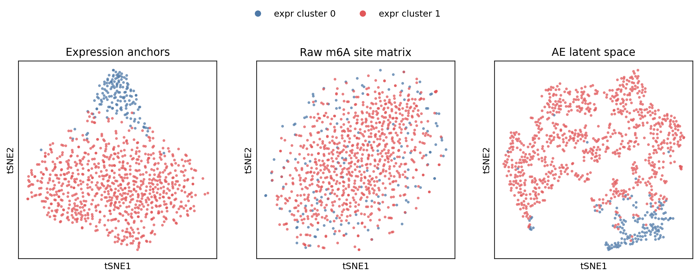
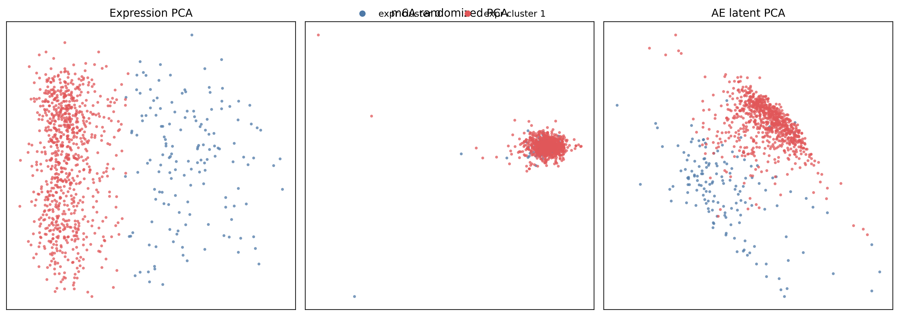
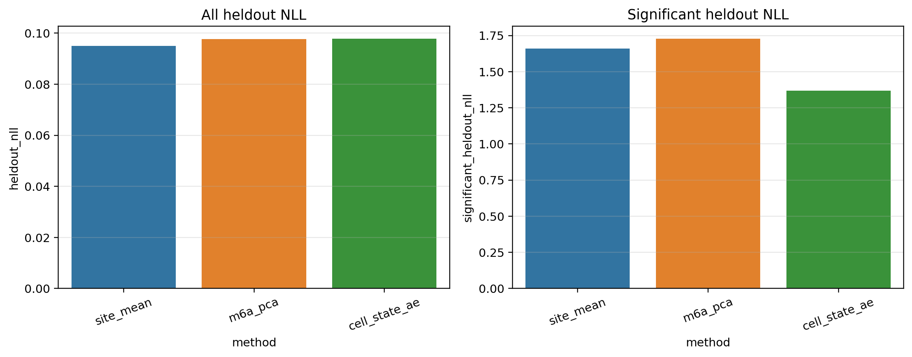
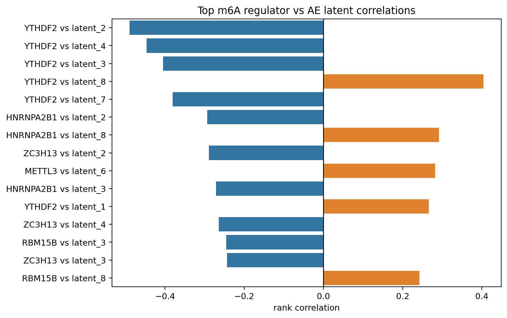
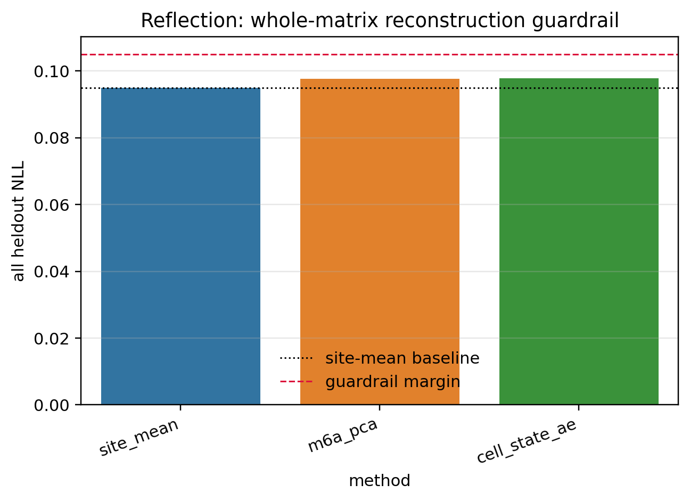

# Cell-State Autoencoder for m6A Regulatory Signal Learning

This project explores whether a count-aware autoencoder can learn biologically meaningful **cell-state / m6A regulatory-state structure** from validated scDART-seq / m6AConquer-derived matrices.

The current direction is deliberately **not** SigRM-style differential m6A site calling. SigRM is used as a statistical reference for count-aware m6A quantification, while this workflow focuses on representation learning and downstream biological interpretability.

## Project Status

Current status: **preliminary but displayable**.

The model finds useful latent biological signal, especially expression-aligned cell structure and regulator-latent association. However, the result is not yet a strong whole-matrix reconstruction success. The main bottleneck is that sparse site-by-cell m6A matrices have uneven coverage and likely over-dispersion, so a simple binomial reconstruction objective is only a partial fit.

## Data Basis

- Input: validated scDART-seq / m6AConquer RDS objects from Step1.
- Cells after QC: `997`.
- m6A sites: `135,300`.
- Step2 output matrices: m6A reads, Total coverage, ratio, masks, site metadata, cell metadata, expression anchor, and m6A regulator expression.
- Step1 is treated as fixed and is not rerun in this branch.

## Method Summary

The model is a cell-state autoencoder trained on cell-by-site m6A matrices.

Input channels:

- `ratio x mask`
- `mask`
- `log1p(capped Total) x mask`

Main implemented loss:

```text
L_main =
sum_ij m_ij w_ij [-y_ij log(p_ij) - (n_ij - y_ij) log(1 - p_ij)]
/
sum_ij m_ij w_ij n_eff_ij
```

Where:

- `y_ij`: methylated m6A reads
- `n_ij`: Total coverage
- `p_ij`: autoencoder-predicted methylation probability
- `m_ij`: observed/train mask
- `w_ij`: confidence weight
- `n_eff_ij = min(n_ij, TOTAL_CAP)`

This is a coverage-capped weighted binomial NLL. It is inspired by count-aware denoising logic, but it is not a direct copy of SigRM or DCA.

## Current Results

| Metric | Value |
|---|---:|
| Cells | `997` |
| Sites | `135,300` |
| Best epoch | `39` |
| Expression vs AE ARI | `0.659` |
| Expression vs m6A PCA ARI | `-0.002` |
| Expression vs AE neighbor overlap | `0.0575` |
| Top regulator-latent pair | `YTHDF2 vs latent_2` |
| Top regulator-latent correlation | `-0.490` |
| AE significant-site NLL | `1.368` |
| Site-mean significant-site NLL | `1.660` |
| AE all-site NLL | `0.0978` |
| Site-mean all-site NLL | `0.0950` |

Interpretation:

- The AE improves reconstruction on significant heldout sites compared with the site-mean baseline.
- The AE latent space is much more aligned with expression-based cell grouping than m6A PCA.
- A strong YTHDF2-latent association suggests the latent space captures biologically relevant m6A regulatory signal.
- Whole-matrix NLL remains close to, and slightly worse than, the site-mean baseline; this is the main result-level limitation.

## Result Bottleneck

The current result is useful for demonstrating a feasible cell-state AE workflow, but it is not sufficient to claim robust denoising of the full m6A matrix.

Main limitations:

- m6A site-by-cell matrices are extremely sparse and coverage-dependent.
- The binomial loss does not fully model over-dispersion in m6A read counts.
- Significant-site reconstruction improves, but all-site reconstruction remains weak.
- Neighbor overlap is positive but still low, so the learned latent structure needs stronger biological validation.
- DCA/scVI-style baselines have not yet been fully implemented in this branch.

## Figures

Key outputs are generated by Step4:











## Reproducible Scripts

```bash
Rscript step02_build_no_site_filter_all135k_input.R
python3 pipeline_scripts/step03_train_cell_state_ae.py
python3 pipeline_scripts/step04_make_figures_and_report.py
```

Step4 only reads Step2 and Step3 outputs. It does not retrain the model or resplit data.

## Output Structure

```text
step02_input/      # model-ready matrices and metadata
step03_outputs/    # trained AE outputs, latent embedding, scores
step04_outputs/    # figures, summary JSON, overall IDEA report
pipeline_scripts/  # reproducible Step3 and Step4 scripts
abandon/           # archived old/generated outputs
```

## Next Work

The next technical improvement should be a stronger count/coverage-aware objective, especially **negative binomial** or **beta-binomial** modelling, to handle over-dispersion. The next biological improvement should be clearer validation of latent dimensions using regulator expression, transcript-position context, expression consistency, and external m6AConquer support. The next benchmark improvement should compare this AE route against DCA/scVI-style baselines.


